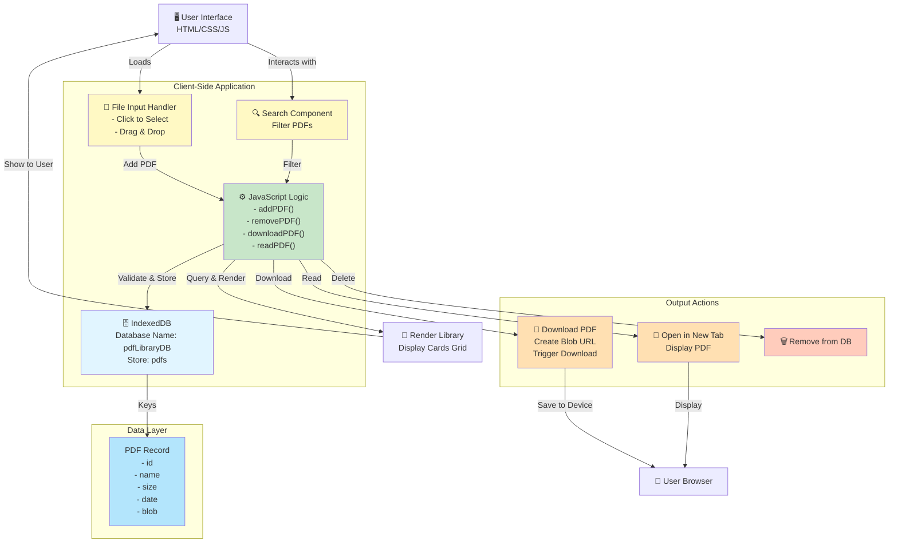
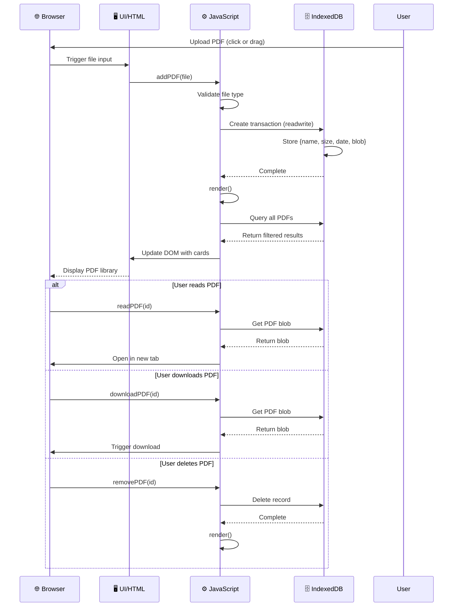

# My PDF Library - Architecture Overview

## System Architecture

## Data Flow Diagram

## Component Breakdown

| Component | Purpose | Technology |
|-----------|---------|-----------|
| **Upload Zone** | Accept PDF files | Drag & drop, File input |
| **Search Bar** | Filter PDFs by name | HTML input + JS filter |
| **Library Grid** | Display stored PDFs | CSS Grid layout |
| **PDF Cards** | Show individual PDF info | HTML template + JS rendering |
| **Action Buttons** | Read, Download, Delete | Event listeners |
| **IndexedDB** | Local persistent storage | Web API |

## Key Features

- **Local Storage**: PDFs stored in browser IndexedDB (no server needed)
- **Search**: Real-time filtering by PDF name
- **Drag & Drop**: Easy file upload
- **Persistent**: Survives browser refresh (until cache is cleared)
- **Security**: HTML escaping to prevent XSS attacks
- **Responsive**: Mobile-friendly grid layout
